# Rendered Diagram Gallery

Every diagram in the AstraNotes docs, rendered to standalone images. The **source
of truth is the Mermaid in the Markdown files** (GitHub renders those inline); these
PNG/SVG exports make the same diagrams viewable offline, in a PDF, or as a supporting
attachment.

Regenerate after editing any diagram:

```bash
python tools/render_diagrams.py     # needs Node + npx (uses @mermaid-js/mermaid-cli)
```

PNG is embedded below; a vector **`.svg`** of the same name sits beside each one.

---

## Architecture & UML — source: [`../uml.md`](../uml.md)

### Class diagram
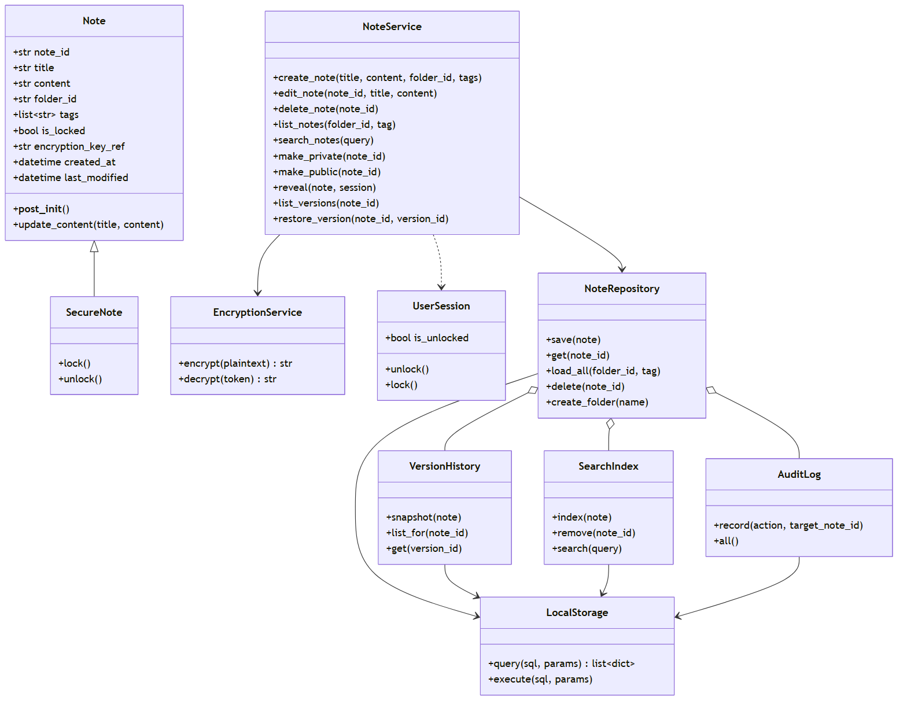

### Use-case diagram
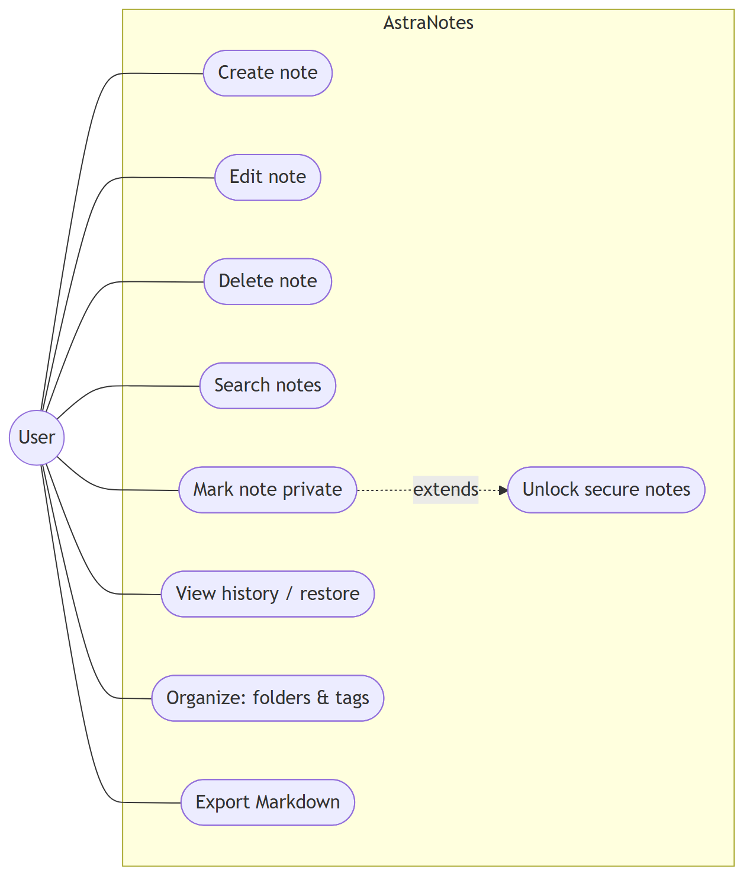

### Activity — Create note (FR-1, with the NFR-2 failure branch)
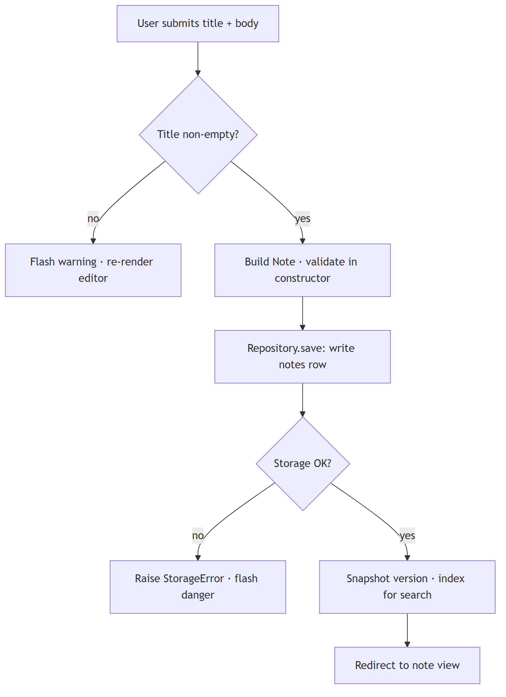

### Activity — Edit note (FR-2)
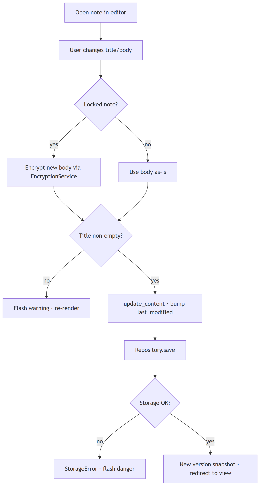

### Activity — Delete note, retaining history (FR-3)
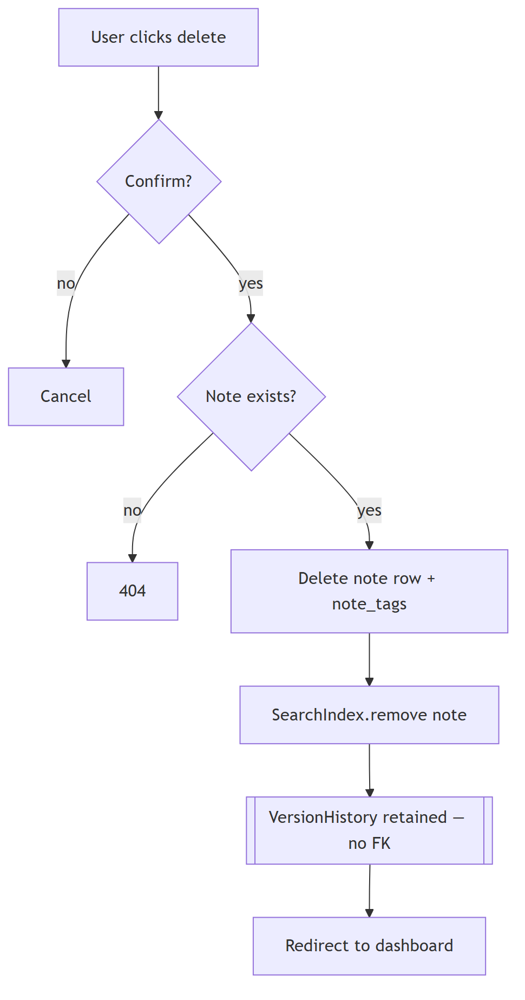

### Activity — Search with edge cases (FR-4)
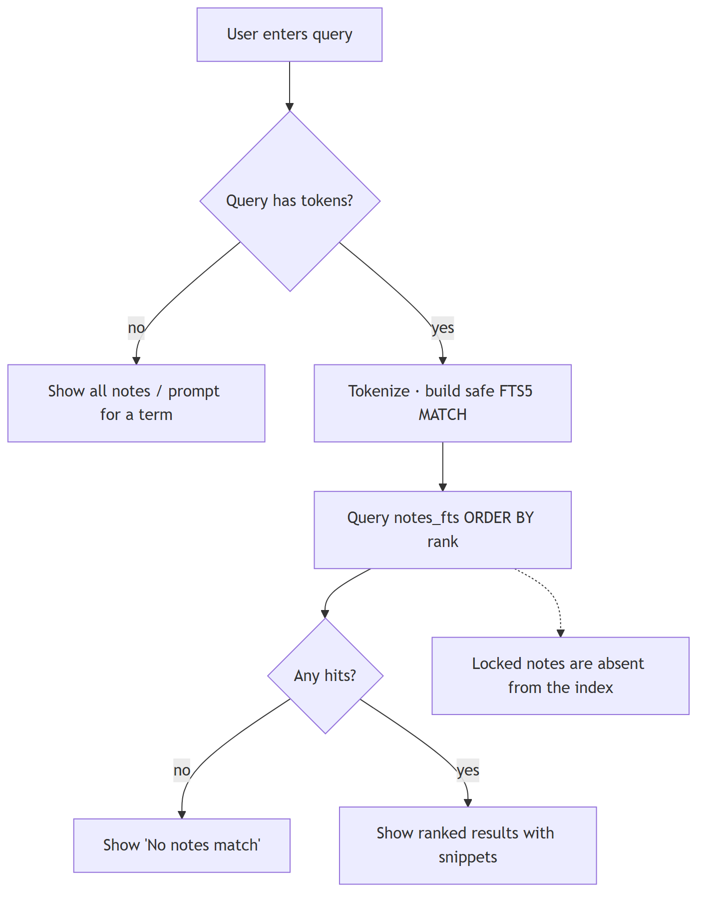

### Deployment (local-first, single node)
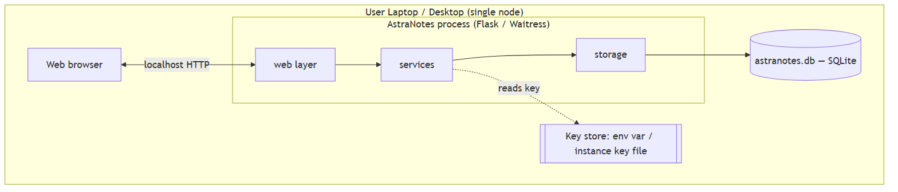

### Sequence — Lock a note (FR-5)
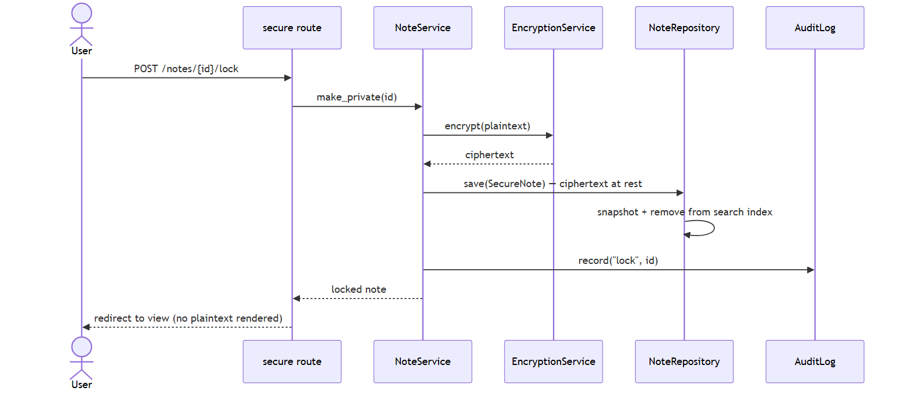

## Architecture overview — source: [`../overview.md`](../overview.md)

### Layers & the dependency rule
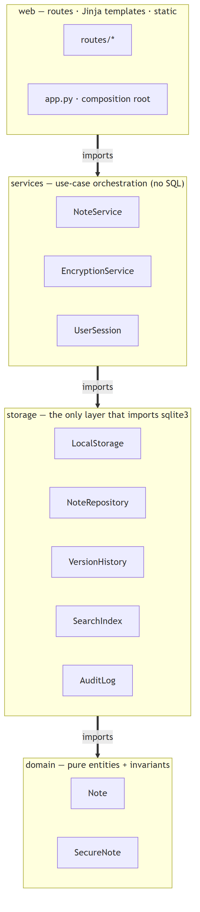

### Data model (entity-relationship)
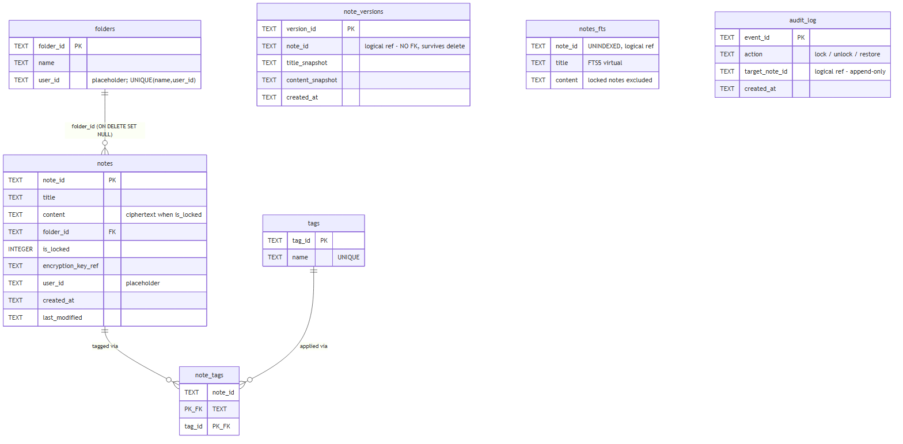

## Security — source: [`../../security/threat-model.md`](../../security/threat-model.md)

### Trust boundary
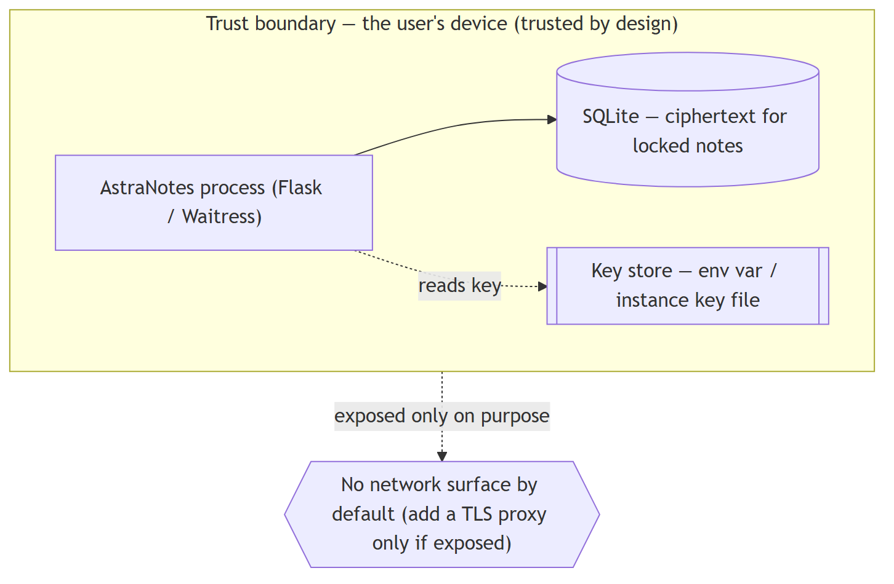

## Planning — source: [`../../planning/waterfall-gantt.md`](../../planning/waterfall-gantt.md)

### Waterfall baseline schedule
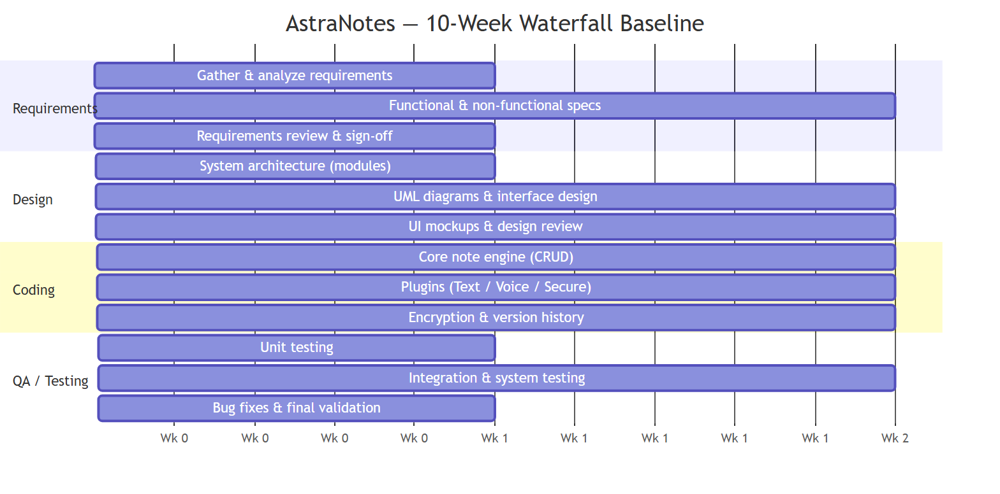
