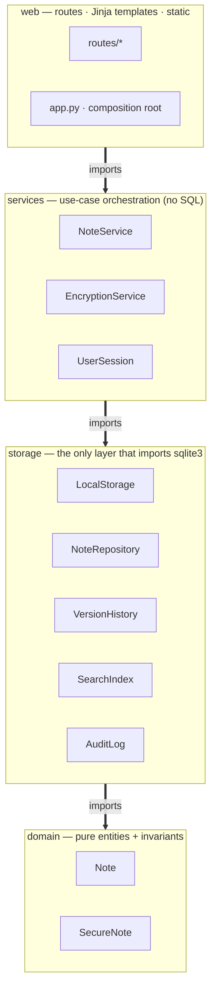
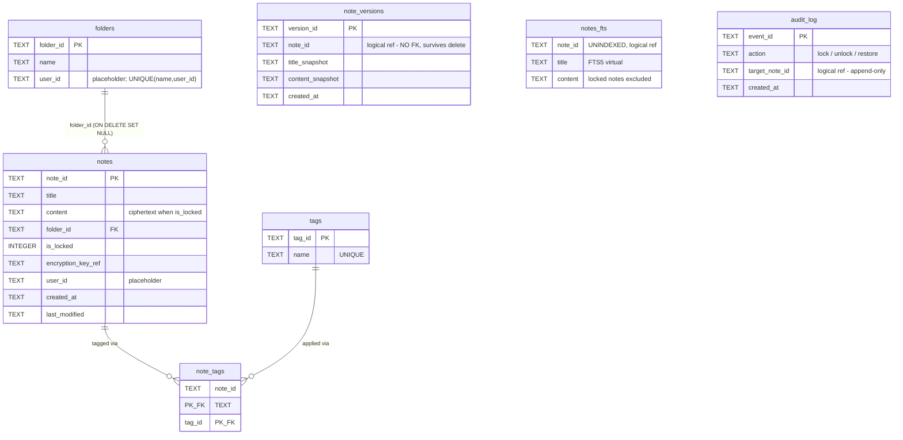

# Architecture Overview

AstraNotes is a **local-first, layered Flask application** backed by a single
SQLite file. The design follows the Week 4.2 UML class diagram and the Week 6
realization; the [UML package](uml.md) holds the diagrams.

## Layers and the dependency rule

The one architectural invariant: **imports only ever point downward.**

```
web        Flask routes · Jinja templates · static (CSS + local preview JS)
  ↓        thin handlers: parse → call service → render
services   NoteService · EncryptionService · UserSession
  ↓        use-case orchestration; no SQL, no Flask types leaking down
storage    LocalStorage · NoteRepository · VersionHistory · SearchIndex · AuditLog
  ↓        the only layer that imports sqlite3; returns plain dicts
domain     Note · SecureNote
           pure entities + invariants; depends on nothing above
shared leaves: config · errors · timeutil
```

The same layering as a diagram (GitHub renders Mermaid inline; a rendered image is
in [`diagrams/`](diagrams/)):



Imports only ever point **down** this chain; nothing points back up — and
`tests/test_architecture.py` fails the build if it does.

- `web` never imports `storage` directly (routes go through `services`); the
  application factory in `web/app.py` is the one composition root that wires the
  layers together.
- `domain` imports nothing from the layers above it.
- This is **enforced by a test**: `tests/test_architecture.py` parses the source
  with `ast` and fails the build on any upward import or any route reaching past
  the service layer (NFR-3, Working Agreement).

## Key components

| Component | Responsibility | File |
|-----------|----------------|------|
| `Note` / `SecureNote` | Entities; title invariant in the constructor | `domain/note.py` |
| `NoteService` | Every use case: create/edit/delete/list/search/restore/lock | `services/note_service.py` |
| `EncryptionService` | Fernet encrypt/decrypt of SecureNote bodies | `services/encryption_service.py` |
| `UserSession` | Unlock state for the browser session | `services/session.py` |
| `LocalStorage` | The only `sqlite3` consumer; wraps errors as `StorageError`; returns dicts | `storage/local_storage.py` |
| `NoteRepository` | Domain ↔ row mapping; owns the aggregates below | `storage/note_repository.py` |
| `VersionHistory` | Snapshots that survive note deletion (no FK) | `storage/version_history.py` |
| `SearchIndex` | FTS5 index; excludes locked notes | `storage/search_index.py` |
| `AuditLog` | Append-only security events | `storage/audit_log.py` |

## Data model

| Table | Purpose | Notes |
|-------|---------|-------|
| `notes` | Title, content, folder, lock state, key ref, timestamps | `content` is ciphertext when `is_locked`; `user_id` placeholder |
| `folders` / `tags` / `note_tags` | Organization (FR-7) | folder name unique per user (`UNIQUE(name, user_id)`) |
| `note_versions` | Snapshot per save (FR-6) | **no FK to notes** → survives delete (FR-3) |
| `notes_fts` | FTS5 virtual table over title+body (FR-4) | locked notes excluded |
| `audit_log` | lock / unlock / restore events (SEC-4) | append-only via triggers |

The same schema as an entity-relationship diagram. Note the three tables with **no
foreign key to `notes`** — that absence is deliberate (`note_versions` survives a
note delete; `notes_fts` and `audit_log` reference a note id only logically):



## Two design principles carried from the artifacts

1. **Validation in the domain constructor, not the service.** An invalid `Note`
   cannot exist in the system regardless of who builds it (Week 6 decision;
   [ADR-0004](../decisions/ADR-0004-domain-owned-invariants.md)).
2. **Primary write before secondary, no cascading rollback.** `NoteRepository.save`
   commits the note first, then snapshots, indexes, and saves tags. A failure in a
   secondary concern never loses the user's note — the failure principle from the
   original Architecture Decision Log
   ([ADR-0006](../decisions/ADR-0006-secondary-write-isolation.md)).

## Request flow (example: lock a note)
```
POST /notes/<id>/lock
  → web/routes/secure.py      parse, get service via deps
    → NoteService.make_private encrypt body, build SecureNote
      → EncryptionService.encrypt   plaintext → ciphertext (Fernet)
      → NoteRepository.save         persist ciphertext (primary)
        → VersionHistory.snapshot   (secondary)
        → SearchIndex.index         removes locked note from the index (secondary)
      → AuditLog.record("lock")     append-only event
  → redirect to the note view (a template never sees plaintext)
```
