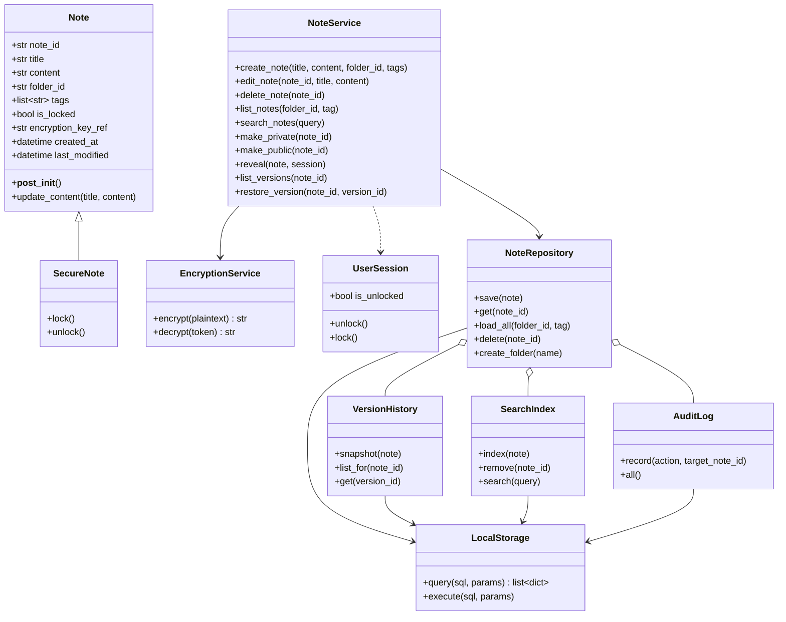
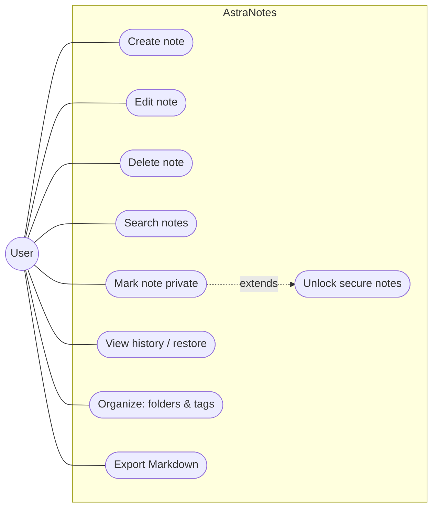
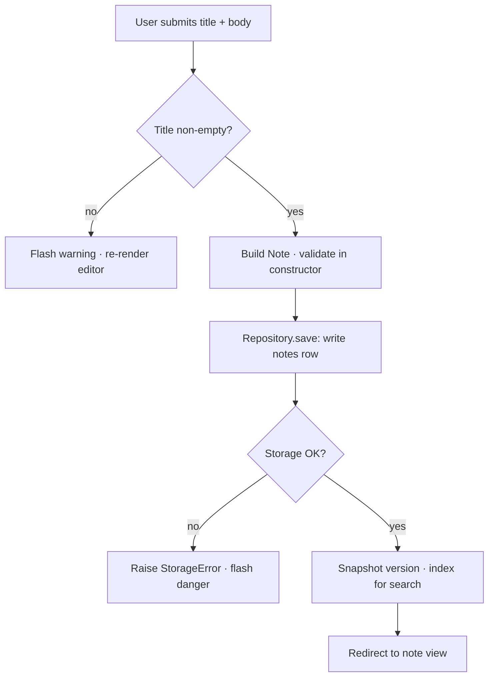
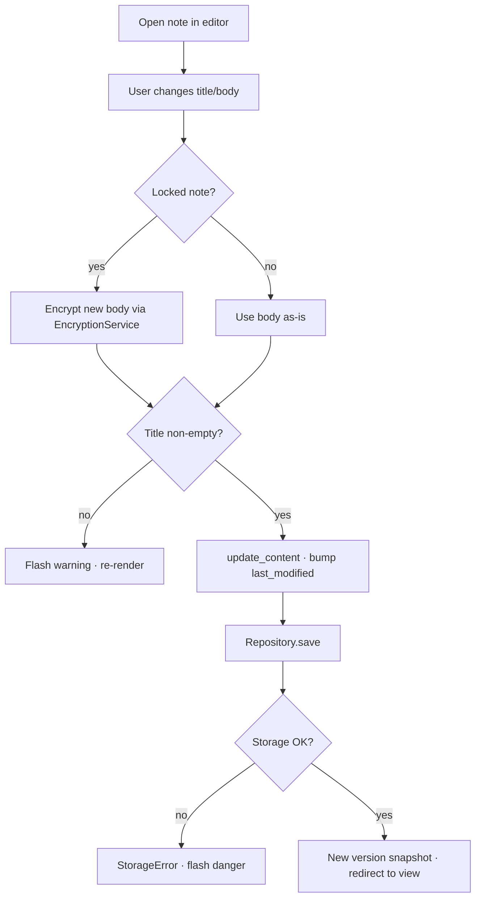
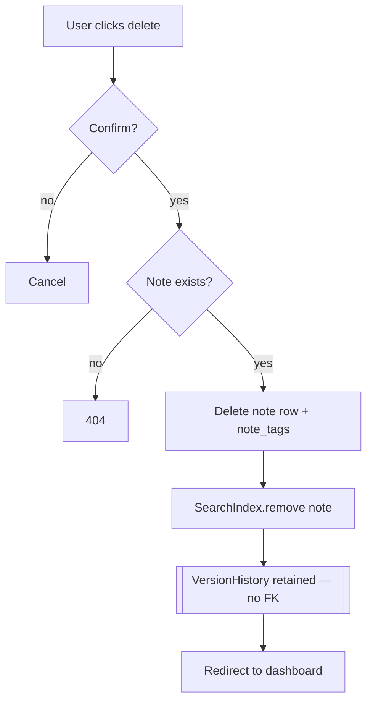
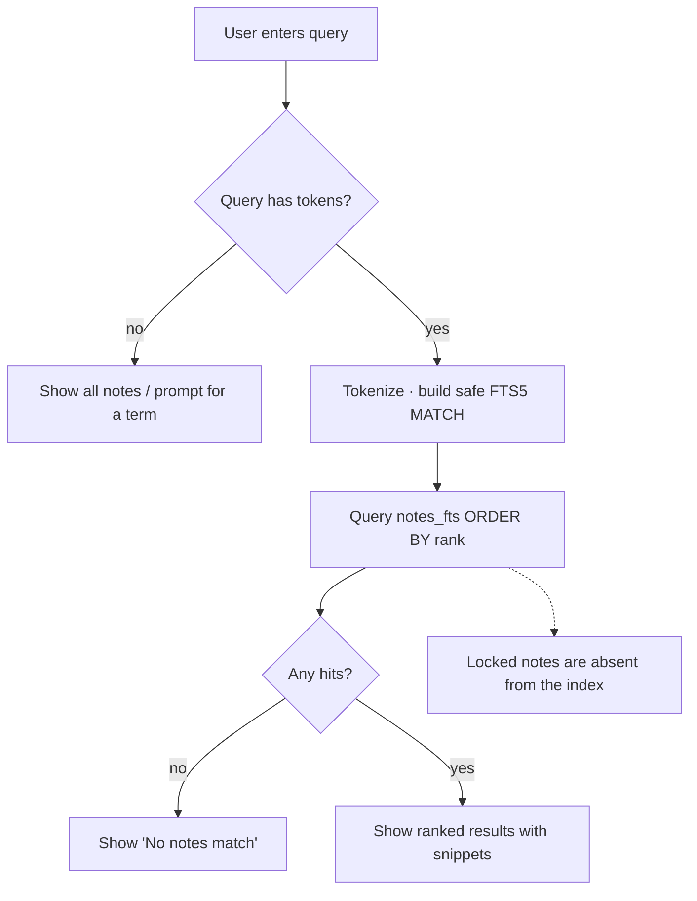
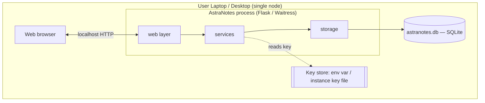
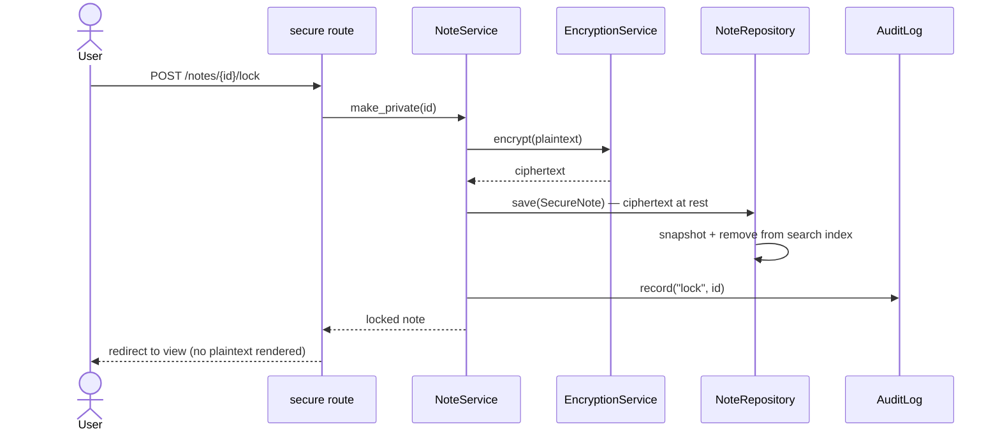

# UML Design Package (Mermaid)

Reproduced from the Week 4.2 UML package and updated to the local-first
realization. The Week 5.2 traceability matrix flagged three behavioral gaps —
**no edit, delete, or search activity diagram** — and a weak failure-handling
story (NFR-2). Those gaps are **resolved here**: edit, delete, and search each
have an activity diagram, and the failure branches (storage write/read failure)
are modeled, not just input validation.

## 1. Class diagram

The hollow-diamond aggregation from `NoteRepository` to `VersionHistory` is the
deliberate choice that lets version records outlive their note (FR-3 + FR-6).

For clarity the `NoteService` box shows the core note use cases; its folder/tag/move
accessors (`list_folders`, `create_folder`, `list_tags`, `move_note` — FR-7) are
elided from the diagram.

## 2. Use-case diagram

## 3. Activity diagram — Create note (FR-1, with NFR-2 failure branch)

## 4. Activity diagram — Edit note (FR-2) — *resolves Week 5.2 gap*

## 5. Activity diagram — Delete note (FR-3) — *resolves Week 5.2 gap*

The retained-history step is the side effect the original delete model never
visualized; it is what makes a deleted note recoverable.

## 6. Activity diagram — Search (FR-4) with edge cases — *resolves Week 5.2 gap*

## 7. Deployment diagram (local-first)

Everything runs on one device. There is **no network boundary and no external
service** (NFR-1), and the encryption key is isolated from the note data — the
local-first equivalent of the original OS-keychain node.

## 8. Sequence diagram — Lock a note (FR-5)

