# Waterfall Baseline Schedule (Lab 1.1)

The original 10-week sequential (no-overlap) waterfall plan, reproduced as a
Mermaid Gantt. This was the earliest planning artifact — written when AstraNotes
was envisioned as a C++ desktop app — and is preserved as a planning exercise.
The stack later evolved (C++ desktop → Next.js + Supabase → Flask + SQLite
local-first) through the documented pivots; the *phase structure* below still
describes how the quarter actually ran.

```mermaid
gantt
    title AstraNotes — 10-Week Waterfall Baseline
    dateFormat X
    axisFormat Wk %s
    section Requirements
    Gather & analyze requirements      :1, 1
    Functional & non-functional specs  :1, 2
    Requirements review & sign-off     :2, 1
    section Design
    System architecture (modules)      :3, 1
    UML diagrams & interface design    :3, 2
    UI mockups & design review         :4, 2
    section Coding
    Core note engine (CRUD)            :6, 2
    Plugins (Text / Voice / Secure)    :7, 2
    Encryption & version history       :7, 2
    section QA / Testing
    Unit testing                       :9, 1
    Integration & system testing       :9, 2
    Bug fixes & final validation       :10, 1
```

**Delivery deadline:** Week 11 (final exam / delivery).

## Change-request scenario & the waterfall lesson
The lab also modeled a mid-project **Cloud Sync** change request. Because pure
waterfall allows no phase overlap, the added design (+2 weeks) and coding
(+3 weeks) work pushed completion from Week 11 to **Week 14 (+4 weeks)** and
compressed QA.

> **Lesson, and why it shaped the real project.** Rigid sequential planning can't
> absorb a mid-project scope change without a schedule blowout. The real
> AstraNotes quarter took the opposite lesson to heart: when the scope actually
> *did* change (the cloud → local-first pivot), the project replanned and
> **descoped** to a coherent vertical slice rather than forcing the original plan
> through. That pivot is documented in
> [ADR-0002](../decisions/ADR-0002-pivot-to-local-first.md) — the human-oversight
> decision at the center of this submission.
